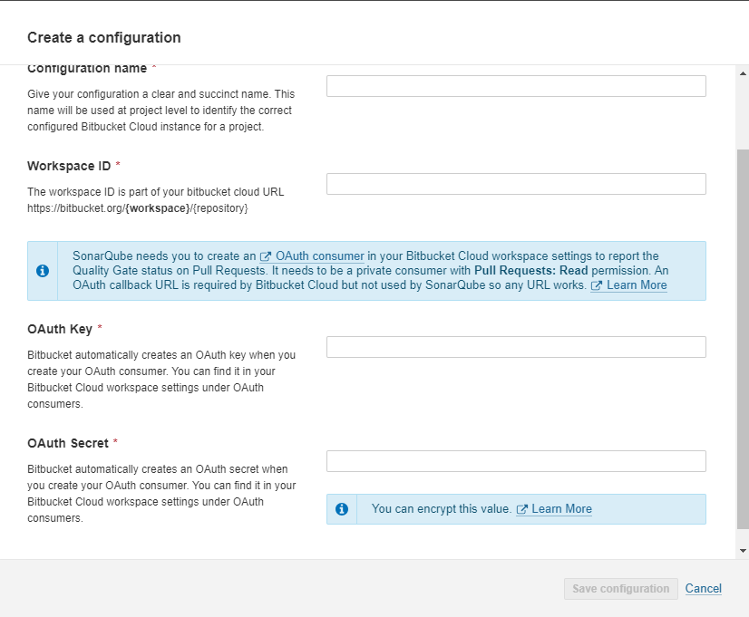
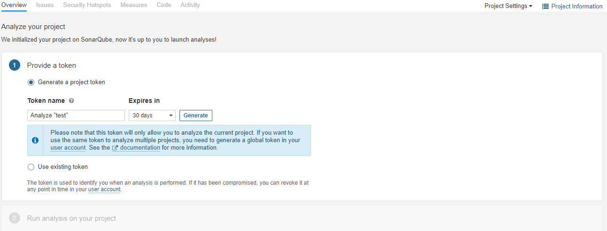
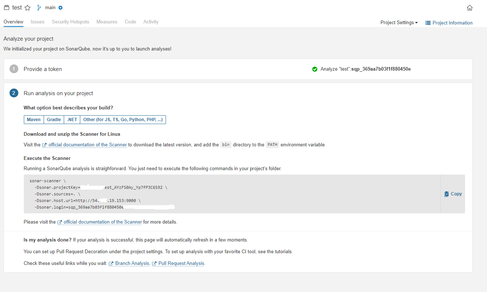

# OAuth on Bitbucket Cloud

For Integration with Bitbucket Cloud follow the following document

https://support.atlassian.com/bitbucket-cloud/docs/use-oauth-on-bitbucket-cloud/

Callback URL should be in format **https://bitbucket.org/{workspace}/{reponame}**

* Make sure to select **This is private consumer** tick box.

In permissions, provide only Read access to Repository and Pull requests.

**Also create a App password for your bitbucket account, use following document.**

https://support.atlassian.com/bitbucket-cloud/docs/create-an-app-password/

# Lets start with the integration part

* Access SonarQube in a web browser and go to Administration > DevOps Platform Integrations > Bitbucket > Bitbucket Cloud

* Fill all the details for OAuth :

* Then  go to Projects > From Bitbucket Cloud 

    * Add your Bitbucket username and app password

* Then select the project which you want to run the sonarqube.

* Select Locally for now and create a new token and continue

* Clone the project you selected above in your local machine and copy the commands provided in Execute the scanner in the project repository.

It will take some time to scan the code and you will see the result on sonarqube web page.
